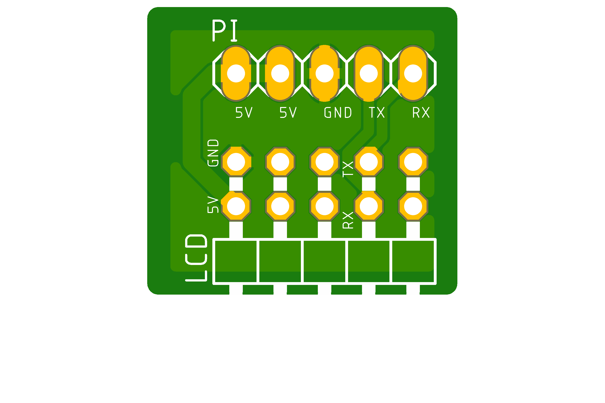
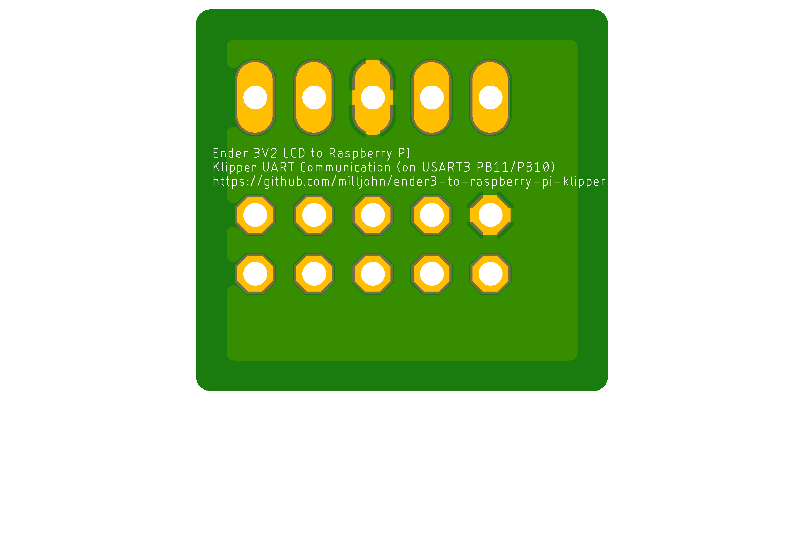
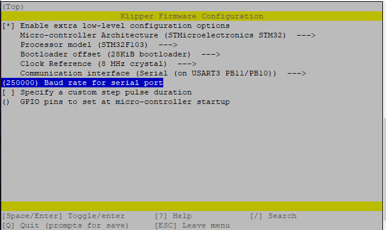
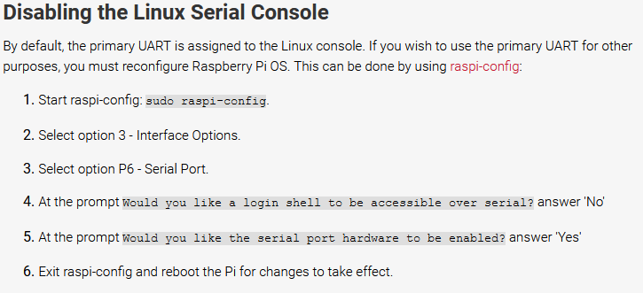

# ender3-to-raspberry-pi-klipper


Raspberry Pi Zero hat that supplies power via Ender 3V2 LCD cable for Klipper. NOTE: this seems to only work a Pi Zero, not a Pi 4. Not tested with a Pi 3 yet.

I made a quick version of this on protoboard, but I'm planning on making a few of these for printers at work and I wanted something a little cleaner and easier to put together.

I originally designed this as a hat, but after thinking about the prototype, it would be better just to make an adapter with crimp connectors.


This was originally posted [here](https://www.reddit.com/r/klippers/comments/q5cu20/how_to_connect_creality_v422_board_to_pi_using/).

## The PCB

The latest version is pi_hat_v2, though it is no longer a hat. I generated the cam files in pcb_files.zip. You can see the rendering below.

### Components
- 1 - 5 position, 2.54mm pitch female (socket) header
- 1 - 10 position, 2 rows, 2.54mm pitch male (pin) 90 degree header

NOTE: I used a 90 degree header so the drawer would close. It will work with straight headers, but you may have clearance issues.






## Klipper Configuration
If you are just starting out, [this guide](https://www.reddit.com/r/klippers/comments/kj2h5r/stepbystep_guide_for_ender_3_v2_klipper_w_bltouch/) will probably be helpful. I've tried to document the steps I took to [setup my printer](#fluidd-pi-configuration)


[Klipper Firmware Configuration](https://i.imgur.com/JYTF8Xj.png)

Add ``serial = /dev/ttyAMA0`` to `printer.cfg`. Your serial port might be different. You can check by power on the Pi via USB and typing `ls /dev` and then comparing it to the list when connected with the ribbon cable. Mine was actually `/dev/ttyS0`. 

## Rasperry Pi Configuration

[Disabling the Linux Serial Console](https://i.imgur.com/P6BS6GC.png)

This may be needed as well:
```shell
sudo echo dtoverlay=disable-bt >> /boot/config.txt
```


## Ender 3V2 Drawer 
I really like this drawer mount.

[Ender 3 v2 Hidden OctoPi Mount](https://www.thingiverse.com/thing:5201485)


## Fluidd Pi Configuration

These are the steps I took to setup Fluidd Pi

1. Burn Fluidd Pi [image](https://github.com/fluidd-core/FluiddPi/releases/latest) to SD Card 
2. Boot the Raspberry Pi
    - Add ssh keys to pi and update `~/.ssh/config`
      - on host: `ssh-keygen -t rsa -b 4096`, I chose no password and saved the file as 3dprinters
      - `mv ~/.ssh/3dprinters ~/.ssh/3dprinters.pem`
      - add the following to ~/.ssh/config
      ```
      host ender3.1
      hostname <raspi-ip-address>
      identityfile ~/.ssh/3dprinters.pem
      user pi

      ```
      - copy the public key to the pi
      ```
      sftp ender3.1
      mkdir -p .ssh
      put ~/.ssh/3dprinters.pub
      bye

      ssh ender3.1
      cd .ssh
      cat 3dprinters.pub >> authorized_keys
      exit
      ```
      - next time you `ssh ender3.1` it will login without a password.


    - `cd klipper && make menuconfig && make`
        - the default for usb is as follows
        
            1. Uncheck `Enable extra low-level configuration options`.
            2. Set processor architecture to `STMicroelectronics STM32`.
            3. Set processor model to `STM32F103`.
            4. Set bootloader offset to `28KiB bootloader`.
            5. Uncheck the other two options (`Use USB` and `Use CAN`).
            6. Save and exit.
        - if setting up serial over LCD cable, use the guide at the top of the page.
    - sftp and copy `~/klipper/out/klipper.bin` to SD card
        - insert into printer and turn on
    - run `~/moonraker/scripts/set-policykit-rules.sh`
    - `cp ~/klipper/config/printer-creality-ender3-v2-2020.cfg ~/klipper_config/printer.cfg`
    - add the lines below to `~/klipper_config/printer.cfg`
    - go to `http://<raspberrypi-ip-address>`
        - Check that everything is working with USB or serial
        - Tail logs, `tail -f ~/klipper_logs/klippy.log` and `tail -f ~/klipper_logs/moonraker.log`
3. `sudo raspi-config`
    - System options
        - setup wireless lan if you didn't already
        - change the default password
        - change the hostname if you want
    - Interface Option
        - ssh
        - serial port
            - no login over serial
            - enable hardware serial port
        - localization options (optional)
            - set to utf-8 and local timezome
    - reboot
    - run `sudo apt update && sudo apt upgrade -y`
4. Check the web interface to see if everything is working
    - check logs if something isn't working


Add this to the `printer.cfg`. I'm not sure why it isn't there by default, but it was frustrating trying to figure out that this was needed.
```
[virtual_sdcard]
path: ~/gcode_files

[display_status]

[pause_resume]

[gcode_macro PAUSE]
description: Pause the actual running print
rename_existing: PAUSE_BASE
# change this if you need more or less extrusion
variable_extrude: 1.0
gcode:
  ##### read E from pause macro #####
  
  ##### set park positon for x and y #####
  # default is your max posion from your printer.cfg
  
  
  ##### calculate save lift position #####
  
  
  
      
  
      
  
  ##### end of definitions #####
  PAUSE_BASE
  G91
  
    G1 E-{E} F2100
  
    {action_respond_info("Extruder not hot enough")}
  
  
    G1 Z{z_safe} F900
    G90
    G1 X{x_park} Y{y_park} F6000
  
    {action_respond_info("Printer not homed")}
  

[gcode_macro RESUME]
description: Resume the actual running print
rename_existing: RESUME_BASE
gcode:
  ##### read E from pause macro #####
  
  #### get VELOCITY parameter if specified ####
  
    
  
    
  
  ##### end of definitions #####
  
    G91
    G1 E{E} F2100
  
    {action_respond_info("Extruder not hot enough")}
    
  RESUME_BASE {get_params}

[gcode_macro CANCEL_PRINT]
description: Cancel the actual running print
rename_existing: CANCEL_PRINT_BASE
gcode:
  TURN_OFF_HEATERS
  CANCEL_PRINT_BASE
```


moonraker.conf
```
[server]
host: 0.0.0.0
port: 7125
enable_debug_logging: False

[file_manager]
config_path: ~/klipper_config
log_path: ~/klipper_logs

[data_store]
temperature_store_size: 600
gcode_store_size: 1000


[authorization]
force_logins: True
cors_domains:
  *.local
  *.lan
  *://app.fluidd.xyz

trusted_clients:
  10.0.0.0/8
  127.0.0.0/8
  169.254.0.0/16
  172.16.0.0/12
  192.168.0.0/16
  FE80::/10
  ::1/128

# enables partial support of Octoprint API
[octoprint_compat]

# enables moonraker to track and store print history.
[history]

# this enables moonraker's update manager
[update_manager]
enable_auto_refresh: True

# this enabled fluidd updates
[update_manager client fluidd]
type: web
repo: fluidd-core/fluidd
path: ~/fluidd
```